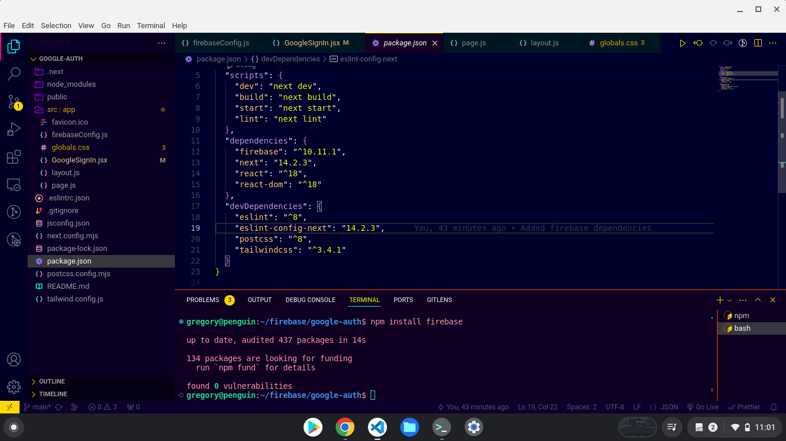
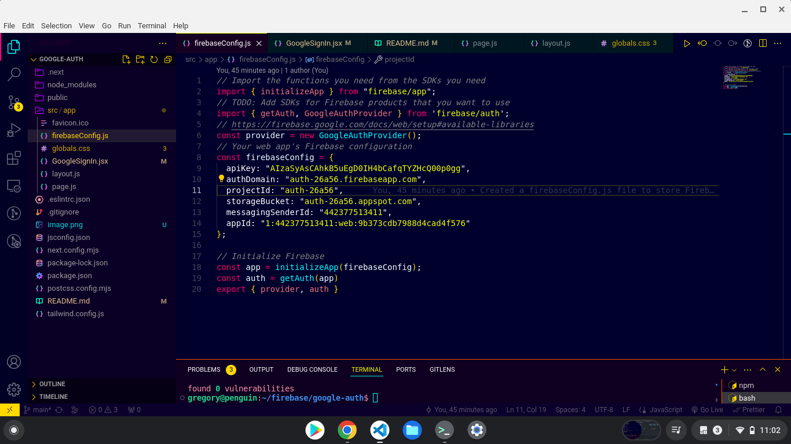
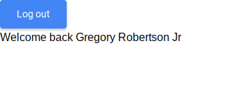

This is a [Next.js](https://nextjs.org/) project bootstrapped with [`create-next-app`](https://github.com/vercel/next.js/tree/canary/packages/create-next-app).

## Screenshots




# My Firebase Authentication Integration Process

Throughout my project, I seamlessly integrated Firebase for user authentication within my React application. Here's how I did it:

## Setting Up Firebase Configuration:

I began by configuring Firebase, initializing the Firebase app with my Firebase configuration. This included essential details like my API key, authentication domain, and other project-specific identifiers.

## Importing Firebase Modules:

To enable Firebase functionality within my React application, I imported necessary Firebase modules such as `initializeApp` from `"firebase/app"`, and `getAuth` and `GoogleAuthProvider` from `"firebase/auth"`. These modules provided functionalities for initializing Firebase and handling user authentication using the Google provider.

## Component Implementation:

Within my React component `GoogleSignIn`, I managed the sign-in and sign-out functionalities:
- I defined a state variable `userObj` using the `useState` hook to keep track of the authenticated user.
- The `handleGoogleSignIn` function utilized `signInWithPopup` method from Firebase authentication to trigger the Google sign-in process. Upon successful sign-in, it updated the `userObj` state with the user's information.
- The `handleLogout` function used the `signOut` method to log the user out and reset the `userObj` state.
- Conditional rendering was used to display different UI elements based on the authentication status. Buttons for sign-in and sign-out were displayed accordingly, and a welcome message was shown when the user was signed in.

## Firebase Authentication Integration:

I seamlessly integrated Firebase authentication functionalities into my React component:
- I used `signInWithPopup` to handle Google sign-in, which opened a pop-up window for the user to authenticate with Google.
- The `signOut` method was used to log the user out when the corresponding button was clicked.

## Error Handling:

I implemented error handling within `try...catch` blocks to manage potential errors during sign-in and sign-out processes. Any errors encountered were logged to the console for debugging purposes.

Overall, my implementation demonstrated a clear understanding of integrating Firebase authentication into a React application, providing users with a smooth and secure authentication experience.


## Getting Started

First, run the development server:

```bash
npm run dev
# or
yarn dev
# or
pnpm dev
# or
bun dev
```

Open [http://localhost:3000](http://localhost:3000) with your browser to see the result.

You can start editing the page by modifying `app/page.js`. The page auto-updates as you edit the file.

This project uses [`next/font`](https://nextjs.org/docs/basic-features/font-optimization) to automatically optimize and load Inter, a custom Google Font.

## Learn More

To learn more about Next.js, take a look at the following resources:

- [Next.js Documentation](https://nextjs.org/docs) - learn about Next.js features and API.
- [Learn Next.js](https://nextjs.org/learn) - an interactive Next.js tutorial.

You can check out [the Next.js GitHub repository](https://github.com/vercel/next.js/) - your feedback and contributions are welcome!

## Deploy on Vercel

The easiest way to deploy your Next.js app is to use the [Vercel Platform](https://vercel.com/new?utm_medium=default-template&filter=next.js&utm_source=create-next-app&utm_campaign=create-next-app-readme) from the creators of Next.js.

Check out our [Next.js deployment documentation](https://nextjs.org/docs/deployment) for more details.
